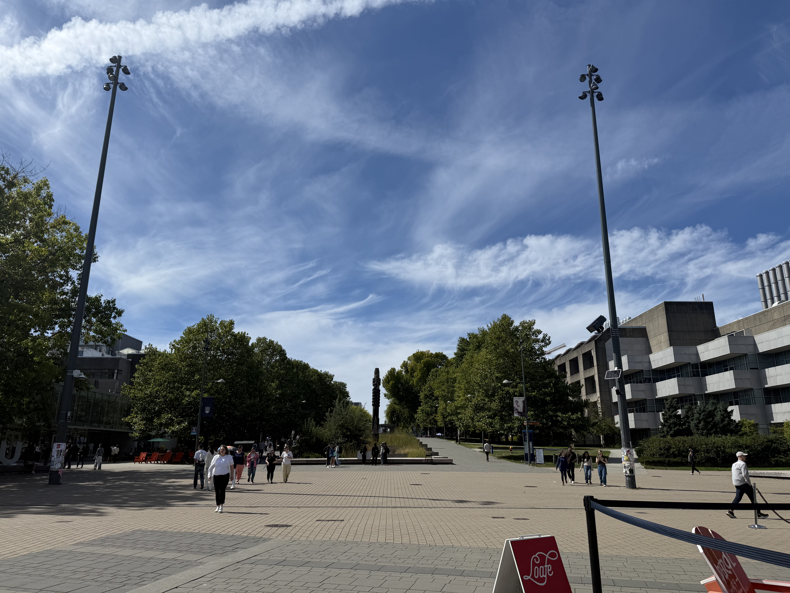

My first weeks in the UBC Master of Data Science program have been both challenging and exciting. I have been learning how to use tools such as Git, GitHub, Bash, VS Code, and Quarto while also adapting to the pace of the program.

One of the biggest changes for me has been becoming more comfortable with programming and command-line tools. At first, some of the workflows felt unfamiliar, but after working through several labs and assignments, I have started to understand how the different tools work together.

I am looking forward to developing stronger skills in programming, statistics, and data analysis throughout the MDS program. I also hope to apply these skills to areas that interest me, including finance, artificial intelligence, and real-world data problems.

{width=600}